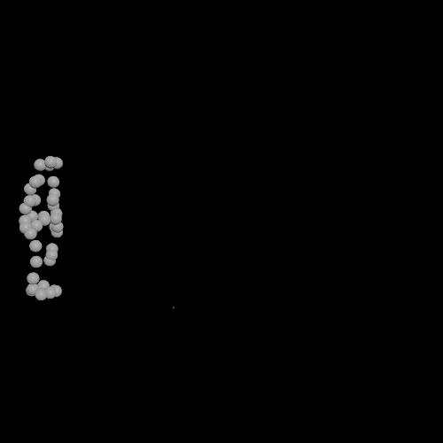

# Python
### HOU Module Inheritence
Houdini convention; classes start with capital case, methods start with lowercase.
```
- hou
  - NetworkItem
    - NetworkMovableItem
      - name()
      - path()
      - Node
        - ObjNode
        - SopNode
        - DopNode
        - PopNode
        - ...
```

```python
print type(hou.node("/obj/geo1")), hou.node("/obj/geo1").name()
print type(hou.pwd()), hou.pwd().name()
# name(), path() Inherited from hou.NetworkMovableItem
#<class 'hou.ObjNode'> geo1
#<class 'hou.ObjNode'> pythonscript1
```

#### ObjNode Class Inheritence
```
- hou
  - NetworkItem
    - NetworkMovableItem
      - ObjNode
```

```python
node = hou.node("/obj/geo1")
print node.name()
print node.path()
print node.children()
print node.inputs()
print node.localTransform()
print node.origin()

parm = node.parm("tx")
print type(parm)
print node.evalParm("tx")

# name(), path(). parent() Inherited from hou.NetworkMovableItem
# inputs(), children() Inherited Methods from hou.Node
#geo1
#/obj/geo1
#(<hou.SopNode of type box at /obj/geo1/box1>, <hou.SopNode of type scatter::2.0 at /obj/geo1/scatter1>, <hou.SopNode of type torus at /obj/geo1/torus1>)
#(<hou.ObjNode of type null at /obj/null1>,)
#[[1, 0, 0, 0],
# [0, 1, 0, 0],
# [0, 0, 1, 0],
# [0, 0, 0, 1]]
#[0, 0, 0]
#<class 'hou.Parm'>
#0.0
```

#### SopNode Class Inheritence
```
- hou
  - NetworkItem
    - NetworkMovableItem
      - SopNode
```

```python
node = hou.node("../geo1/")
sop = node.children()[1]
print type(sop)
print sop.geometry()
print sop.inputGeometry(0)

parm = node.parm("tx")
print type(parm)
parm.set(10)
print parm.eval()
parm.revertToDefaults()
print parm.eval()
print parm.name()
print parm.node()

#<class 'hou.SopNode'>
#<hou.Geometry in /obj/geo1/scatter1 read-only>
#<hou.Geometry in /obj/geo1/box1 read-only>
#<class 'hou.Parm'>
#10.0
#0.0
#tx
#geo1
```

### Mocap Data Reader (mocapTxtReader.hipnc, pyMocapReader.py)

### Code To Run UI File In Houdini
```python
import hou
import os

from hutil.Qt import QtCore,QtWidgets,QtUiTools

path = os.path.dirname(__file__)

class AttribManager(QtWidgets.QWidget):
    def __init__(self):
        super(AttribManager,self).__init__()

        #load UI file
        self.ui = QtUiTools.QUiLoader().load(path + '/attribman.ui')

        #layout
        mainLayout = QtWidgets.QVBoxLayout()
        mainLayout.setContentsMargins(0,0,0,0)
        mainLayout.addWidget(self.ui)
        self.setLayout(mainLayout)

        self.setParent(hou.ui.mainQtWindow(), QtCore.Qt.Window)

def show():
    win = AttribManager()
    win.show()
```

### Trigger Python Module Function From HDA Parameters Callback Script
1. In Type Properties Panel -> Scripts Tab create an Event Handler for Python Module.
2. Type your code

3. In Parameters Tab, create parameter with Callback Script, change script type to Python
4. Type the code below in Callback Script to trigger the function in Python Module

```python
hou.pwd().hdaModule().MyFunc()
```
or
```python
kwargs['node'].hdaModule().MyFunc()
```

### Houdini Command Line Rendering (hython - hrender)

Set Windows Environment Varaiable (Path - C:\Program Files\Side Effects Software\Houdini 18.0.460\bin)

```python
hython "C:\Program Files\Side Effects Software\Houdini 18.0.460\bin\hrender.py" camera_clouds.hipnc -d mantra1 -e -f 1 120
```

