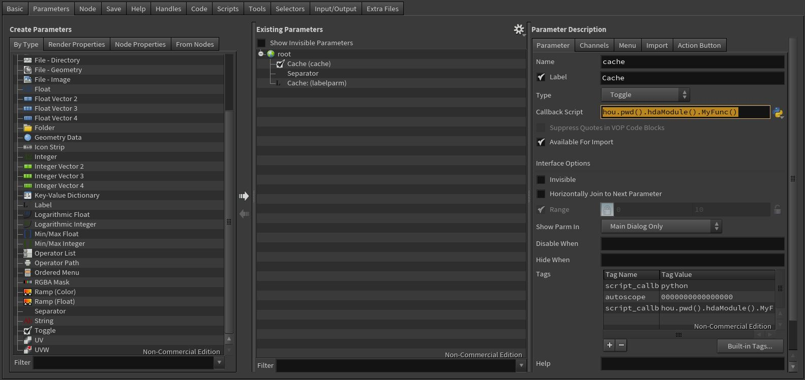

# Python
### Mocap Data Reader (mocapTxtReader.hipnc, pyMocapReader.py)

### Code To Run UI File In Houdini
```python
import hou
import os

from hutil.Qt import QtCore,QtWidgets,QtUiTools

path = os.path.dirname(__file__)

class AttribManager(QtWidgets.QWidget):
    def __init__(self):
        super(AttribManager,self).__init__()

        #load UI file
        self.ui = QtUiTools.QUiLoader().load(path + '/attribman.ui')

        #layout
        mainLayout = QtWidgets.QVBoxLayout()
        mainLayout.setContentsMargins(0,0,0,0)
        mainLayout.addWidget(self.ui)
        self.setLayout(mainLayout)

        self.setParent(hou.ui.mainQtWindow(), QtCore.Qt.Window)

def show():
    win = AttribManager()
    win.show()
```

### Trigger Python Module Function From HDA Parameters Callback Script
1. In Type Properties Panel -> Scripts Tab create an Event Handler for Python Module.
2. Type your code

3. In Parameters Tab, create parameter with Callback Script, change script type to Python
4. Type the code below in Callback Script to trigger the function in Python Module

```python
hou.pwd().hdaModule().MyFunc()
```
or
```python
kwargs['node'].hdaModule().MyFunc()
```


